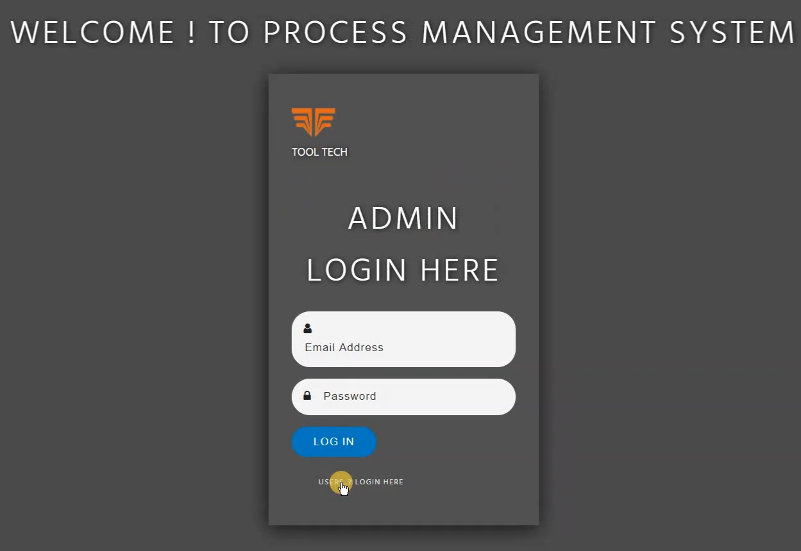
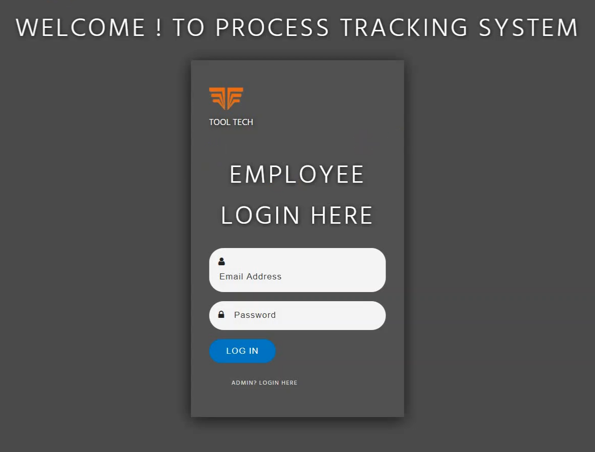
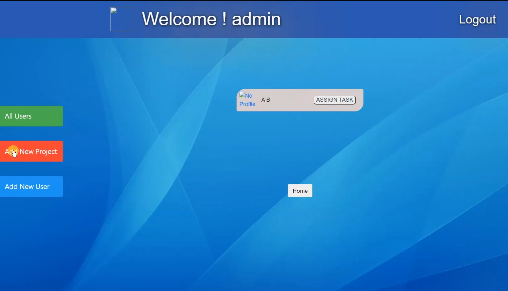
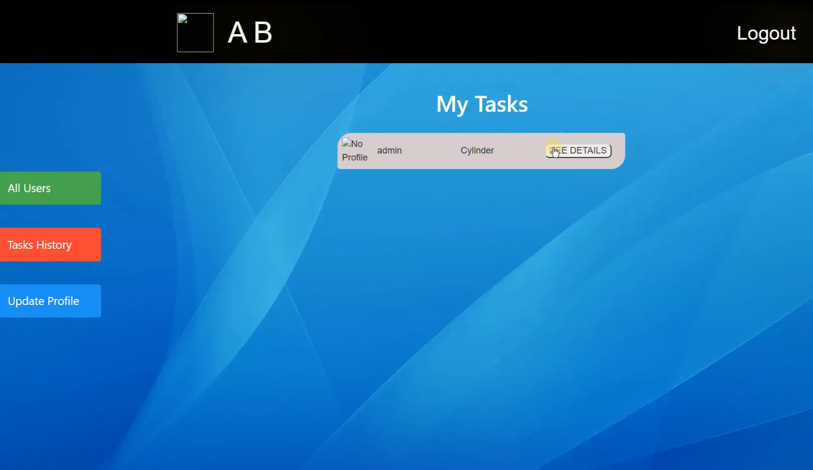

# Process_Management_System

# Project Demo:

[First lets get to the project demo that was published on the official handle of MASSIA IFC](https://twitter.com/Massiaifc/status/1297726643587280896?s=09)

# Project Screenshots:

### Admin Login

 

### User Login

 

### Admin Dashboard

 

### User Dashboard

# Technology Stack:

1) Front-End:
--> HTML 
--> CSS
--> Javascript
--> Bootstrap 4

2) Back-End:
--> PHP
--> MySQL

# Functionalities:

This task management system script contains two sections :-

1) Admin   

--> Admin can create new user,new task,give tasks to the users, can enable and disable task,user,comment. 

--> Admin can block user 

--> Admin can comment on tasks and can delete or hide the tasks.

2) User 

--> User can give task to each other 

--> Users can update their profile.

--> Users can comment on each other's tasks. 

# Special_Functionalities:

--> There is no registration for admin 

--> Users can be created by admin only.

--> For creating admin we have to create manually in database. 

